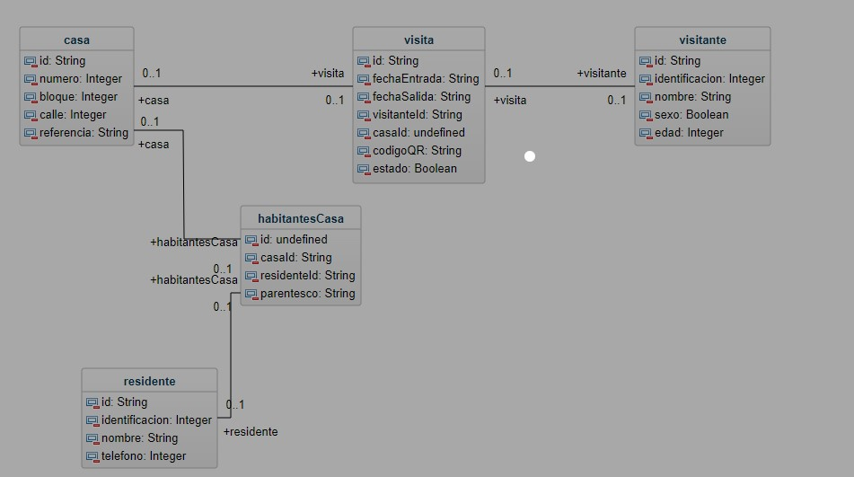

# Examen de Reposicion de Sergio Barahona

## Introduccion
El siguiente repositorio muestra el trabajo realizado como parte del examen de reposicion de la primera evaluacion en la clase de Programacion 4 de Sergio Barahona - 61351186

## Diagrama UML del Proyecto
El proyecto de Back-end fue realizado en base a las clases, controladores, repositorios y relaciones que se pueden determinar en el diagrama UML que esta enlace en este archivo

## NOTA IMPORTANTE
Multiples commits fueron realizados en el repositorio original para este examen: https://github.com/srgio29/ExamenReposicion
Sin embargo, por problemas tecnicos se tuvo que realizar un repositorio diferente para poder continuar con el proyecto, ya que no se podia actualizar los archivos en el repositorio original. Favor de observar los commits realizados en ambos repositorios.

## Enlace en Railway
A continuacion adjunto el enlace directo hacia Railway:
[Enlace de Railway](https://examenreposicion2-production.up.railway.app/)
